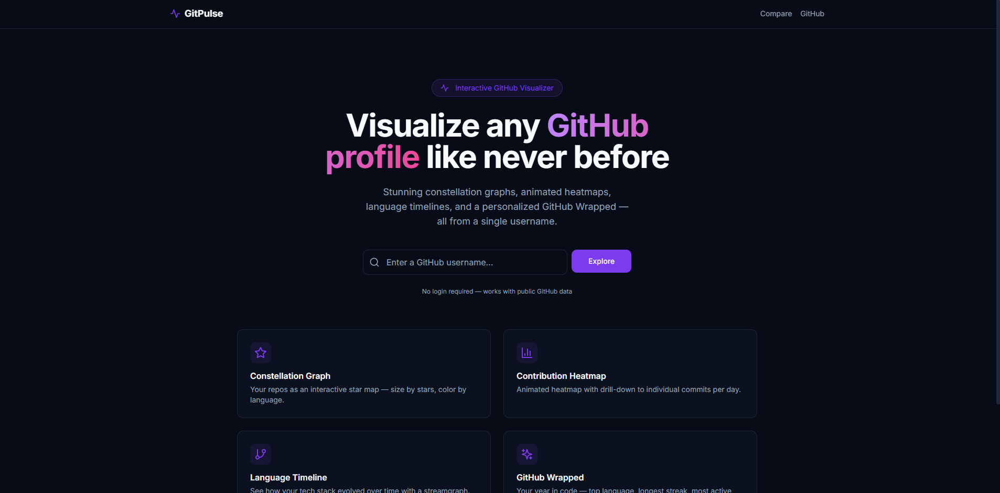
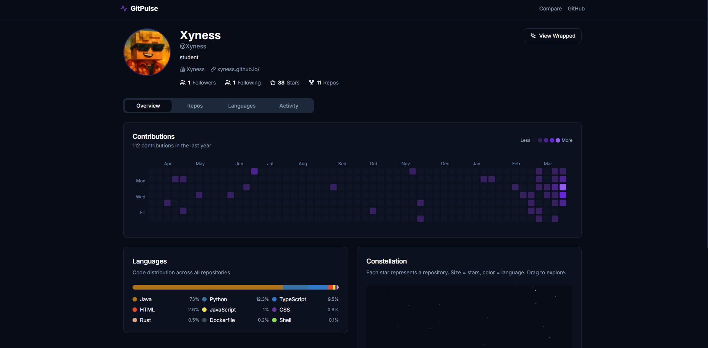
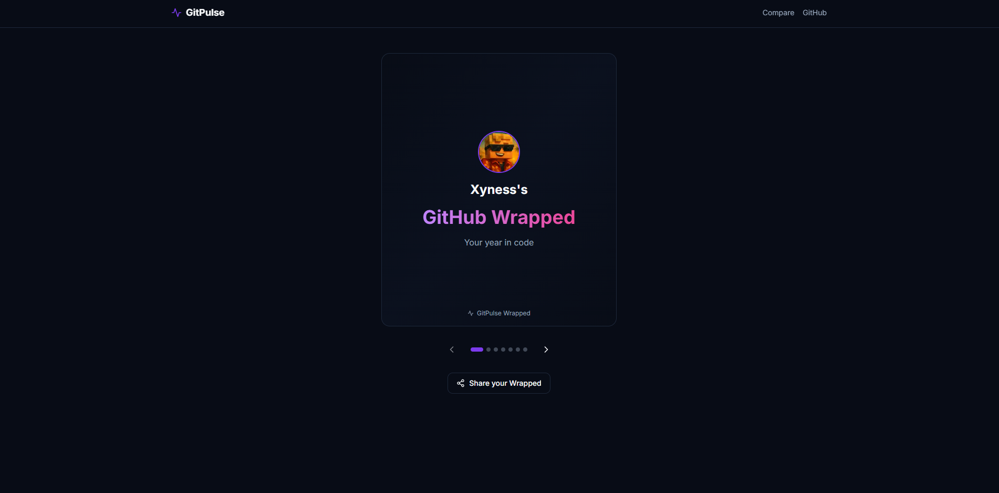

# GitPulse

Type in a GitHub username and get their public activity back as something worth
looking at.

**[Live demo](https://git-pulse-virid.vercel.app)**



## What's in it

The main one is the **constellation**: every repo is a circle, sized by stargazers and
coloured by language, laid out by a force simulation that pulls repos sharing a language
towards each other. Drag them around, scroll to zoom, click one to open it.

Next to that there's a **contribution heatmap** you can click into day by day, a
**streamgraph** of which languages turned up when, and a reverse-chronological list of
the last thirty repos.

**Wrapped** is the Spotify-Wrapped-style thing: seven slides covering the year's totals,
top language, longest streak, busiest repo. It gets its own URL, so it's shareable.

**Compare** puts two profiles side by side, and `/widget/[username]` is a stripped-down
page meant to be dropped into an iframe:

```html
<iframe src="https://git-pulse-virid.vercel.app/widget/torvalds" />
```

No login anywhere, it only ever reads public data.





## Running it locally

```bash
git clone https://github.com/Xyness/GitPulse.git
cd GitPulse
npm install
cp .env.example .env.local
npm run dev
```

Works with no configuration, but you'll hit GitHub's unauthenticated rate limit (60 requests
an hour) after a handful of profiles. Drop a token in `.env.local` and that becomes 5000:

```env
GITHUB_TOKEN=ghp_your_token_here
```

The token needs no scopes, public data only.

## Routes

| Route | |
| --- | --- |
| `/` | Search |
| `/[username]` | Full profile, every visualization |
| `/org/[name]` | Organization view |
| `/wrapped/[username]` | Wrapped slides |
| `/compare` | Two profiles side by side |
| `/widget/[username]` | Embeddable, no chrome |
| `/api/profile/[username]` | The JSON behind the pages |
| `/api/og?username=X` | Generated OG image |

## Notes on the build

Data comes from GitHub's GraphQL API through `@octokit/graphql`, one query per profile rather
than a fan-out of REST calls. Contribution calendars are only exposed over GraphQL anyway.

Responses are cached in a `Map` in module scope for ten minutes. That's per serverless instance
and it evaporates on cold start, which is fine here: it costs nothing and the failure mode is a
slower page.

Every D3 component tears its SVG down and redraws on resize instead of doing a proper
enter/update/exit. At a few hundred nodes it isn't worth the complexity.

Colours are GitHub's own dark palette, and the contribution squares are the same five greens
as the real thing. Making people relearn what a dark square means would be a waste of
everybody's afternoon.

Next.js 14 App Router and Tailwind for the shell. Button, card and tabs started life as
shadcn/ui, and Radix is still under the tabs. D3 draws anything with an axis. Framer Motion
only appears in the Wrapped slides; everywhere else things simply turn up. OG images are
generated at request time by `@vercel/og`.

## Contributing

See [CONTRIBUTING.md](CONTRIBUTING.md).

## License

MIT
